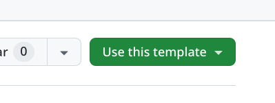
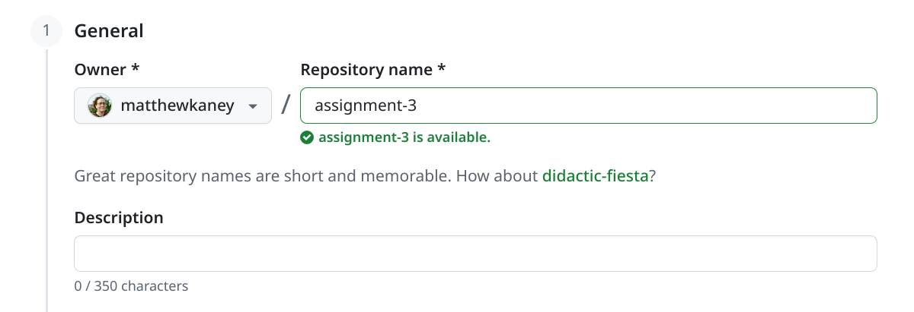
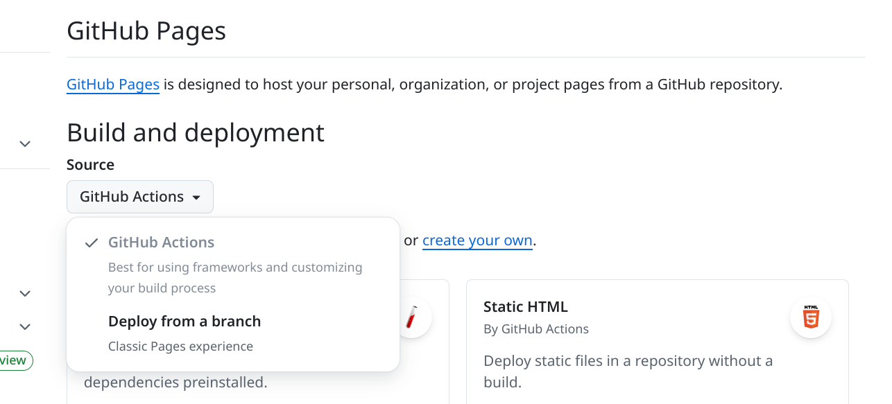

# Assignment 3 Template

Use this template repository as a starting point for Assignment 3: Interactive Archive.

## Creating Your Assignment Repository

1. From the main page of this repository, click on the **Use this template** button and select **Create a new repository** 
2. Create the repository under your own account and give it a name that indicates the class or assignment number 
3. In your new repository, enable GitHub pages by going to **Settings** then **Pages** and setting the **Source** to **GitHub Actions**  Once this is set up, then your repository should automatically build and deploy to GitHub pages every time you push any new changes.
4. Clone your repository to your local machine to work
   - In a terminal, run `npm install` once to install the dependencies
   - Then, run `npm run dev` to start it running on a local server
